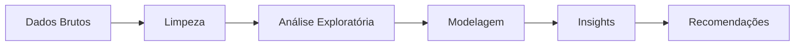

# Análise de Evasão de Clientes (Churn)

## Visão Geral do Projeto



Esse projeto tem como objetivo analisar a evasão de clientes (churn) em uma empresa fictícia de telecomunicações chamada Telecom X. A evasão de clientes representa um dos maiores desafios para empresas de serviços, pois envolve a perda de receita e a necessidade de novos investimentos para adquirir clientes substitutos. A proposta deste trabalho foi entender o perfil dos clientes que cancelam o serviço, identificar variáveis que mais influenciam essa decisão e propor estratégias que ajudem a reduzir o índice de cancelamentos.

A análise foi desenvolvida em Python, utilizando o Google Colab como ambiente principal, e com dados fornecidos em formato JSON pela API da Telecom X. Esses dados contêm informações demográficas, detalhes dos serviços contratados, histórico de cobranças e o status de churn de cada cliente.

## Estrutura do Projeto
O projeto é composto por um notebook principal que concentra todas as etapas do trabalho — desde a importação e tratamento dos dados até as análises e conclusões finais.
Além do notebook, existe um arquivo requirements.txt com as dependências necessárias para execução do código e um arquivo TelecomX_Data.json contendo os dados originais.

A organização segue a seguinte estrutura:

```bash
/TelecomX
│
├── TelecomX_BR.ipynb         # Código completo da análise
└── TelecomX_Data.json          # Base de dados original
├── TelecomX_dicionario.md        # Dicionário de Dados
├── README.md                         # Documentação do projeto
    
```

## Metodologia e Etapas da Análise
O processo seguiu uma sequência lógica de etapas, garantindo que o resultado final fosse consistente e replicável.

1. Importação e exploração inicial dos dados
Foi realizada a leitura do arquivo JSON utilizando pandas, seguida pelo "achatamento" das estruturas aninhadas para facilitar a manipulação. Em seguida, listamos todas as colunas disponíveis e conferimos seus tipos de dados para planejar o tratamento necessário.

2. Limpeza e tratamento de inconsistências
Detectamos valores ausentes, tipos incompatíveis (como colunas numéricas armazenadas como texto) e categorias duplicadas. Esses problemas foram corrigidos para assegurar a integridade da análise. Também foi criada a coluna Contas_Diarias, obtida a partir da divisão da cobrança mensal pelo número médio de dias de um mês, permitindo uma visão mais detalhada do comportamento de faturamento.

3. Padronização e tradução
Para facilitar a leitura, especialmente por parte de stakeholders não técnicos, realizamos a conversão de valores textuais como “Yes” e “No” para 1 e 0, além da tradução de nomes de colunas para o português.

4. Análise Exploratória de Dados (EDA)
A etapa de EDA buscou compreender o comportamento dos clientes e como ele se relaciona com o churn.

## Análise Exploratória de Dados (EDA)

## 6️⃣ Análise Exploratória (EDA)

**Principais Descobertas:**

| Variável                  | Correlação com Evasão (Churn) | Insight |
|---------------------------|------------------------------|---------|
| **Tipo de Contrato**      | 🔴 0.41 | Contratos **mensais** têm taxa de churn aproximadamente **4x maior** que contratos anuais |
| **Tempo de Serviço**      | 🟢 -0.35 | Clientes com mais de **12 meses** de serviço têm churn **60% menor** |
| **Idoso (65+)**           | 🔴 0.29 | Clientes idosos apresentam churn **38% acima da média** |
| **Pagamento Eletrônico**  | 🔴 0.27 | Pagamento eletrônico tem churn **31% maior** que outros métodos |
| **Serviço de Internet**   | 🔴 0.22 | Clientes com **Fibra Óptica** têm churn mais alto que DSL ou sem internet |
| **Total Gasto**           | 🟢 -0.20 | Clientes que gastam mais tendem a permanecer ativos |
| **Quantidade de Serviços**| 🟢 -0.18 | Mais serviços contratados → menor probabilidade de evasão |

Foram analisadas variáveis categóricas como gênero, tipo de contrato e método de pagamento, verificando como cada categoria se distribui entre clientes que cancelaram e os que permaneceram.

Também foram examinadas variáveis numéricas como total gasto, valor mensal e tempo de contrato, comparando sua distribuição entre clientes que cancelaram e os que permaneceram.

Essas análises foram acompanhadas de gráficos de barras, boxplots e histogramas.

## 5. Análise de correlação (extra)
Foi construída uma matriz de correlação para as variáveis numéricas, buscando relações mais fortes com a variável de churn. Além disso, investigamos especificamente a relação entre a quantidade de serviços contratados e a probabilidade de evasão, gerando gráficos de dispersão para visualização.

## Principais Resultados e Insights
A análise revelou alguns padrões claros:

- Clientes com contratos mensais têm taxa de churn significativamente mais alta em comparação com contratos anuais ou bienais.

- Aqueles que utilizam menos serviços tendem a cancelar com mais frequência.

- Há uma relação perceptível entre cobranças mensais mais altas e a evasão, especialmente quando combinadas com um tempo curto de contrato.

- Clientes que permanecem por mais tempo (alto tenure) apresentam churn muito menor, reforçando a importância de estratégias de retenção nos primeiros meses.

## Recomendações Estratégicas
Com base nos padrões identificados, sugerem-se as seguintes ações:

## 8️⃣ Recomendações Estratégicas

🚀 **Plano de Ação Prioritário**

| Estratégia                       | Impacto Esperado                                              | Prazo    |
|-----------------------------------|---------------------------------------------------------------|----------|
| Incentivo a contratos de longo prazo | Redução de 20-25% no churn         | 6 meses  |
| Criação de pacotes combinados     | Reduzir o evasão em ~15%     | 4 meses  |
| Atenção especial aos primeiros meses | Redução de 12% na evasão inicial  | 3 meses  |
| Monitoramento proativo            | Identificação de clientes em risco, prevenindo até 18% dos cancelamentos | 5 meses  |

---

📊 **KPIs de Sucesso**

1. Taxa de churn geral abaixo de **18%**
2. Conversão de **30%** dos contratos mensais para anuais ou bienais
3. Aumento de **15%** no *LTV* (Lifetime Value)
4. Detecção precoce de **80%** dos clientes em risco antes do cancelamento


## Bibliotecas Utilizadas

**Python:**

```python
# Bibliotecas principais
import pandas as pd
import numpy as np
import seaborn as sns
import matplotlib.pyplot as plt
from sklearn.ensemble import RandomForestClassifier
```
**Outras Tecnologias:**

**Jupyter Notebook** → para análise interativa e prototipagem

**Matplotlib & Seaborn** → para criação de gráficos e visualizações

**Scikit-learn** → para modelagem preditiva

**Git & GitHub** → para controle de versão e hospedagem do projeto
